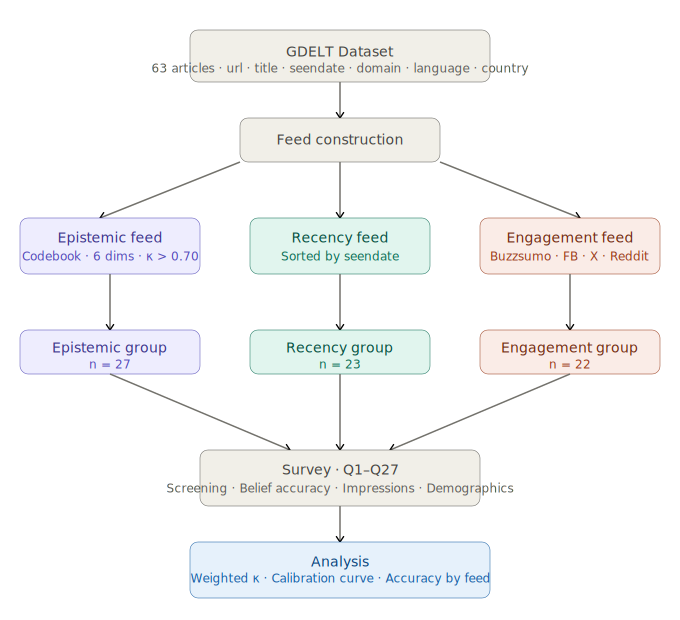

# Does Feed Curation Shape What Readers Know?

_A Controlled Experiment on Algorithmic News Exposure_

Zeynep Guzey, Jaeyun Stella Seo, Inseon Hwang, Jocelyn Ding

CS 294-273 Designing Algorithmic Media, Spring 2026

Professor Jonathan Stray

This Github repo contains all relevant files pertaining to the project, which explores how news feed curation can affect beliefs in the aftermath of a crisis. In particular, we build a case study around the assassination attempt of Slovakian Prime Minister Robert Fico in 2024. After collecting a corpus of news articles in the first 24 hours after the event, we organize them into three different media feeds: one optimized for engagement, one optimized for recency, and one optimized for epistemic integrity. We find that though users of the feeds do not perceive them to be any different (eg: more trustworthy, more biased), users of the engagement-optimized feeds are confidently wrong about their answers to factual questions surrounding the event.

## Methodology



## Results

## Future Work

## Project Structure

```
feed-curation-and-reader-comprehension/
├── html/                  # Survey interface files
├── apps-script/           # Data collection automation
├── Codebook.pdf          # Article scoring methodology
└── data-and-analysis/    # Datasets and analysis notebooks
```

### html

Contains the HTML files used to build the Netlify surveys sent to participants.

### apps-script

Script written to collect survey information from the Netlify app to Google Sheets.

### Codebook.pdf

The codebook used to score articles across six different axes: evidence & attribution, uncertainty signaling, context completeness, conflict framing, affective intensity, and call to action.

### data-and-analysis

Contains the data (`engagement.csv`, `epistemic.csv`, `recency.csv`) used for our most recent analysis for the final report, as well as the data used to generate our final presentation (a week prior to the final report) within "Final Presentation." The analysis is done within `analysis.ipynb`.
