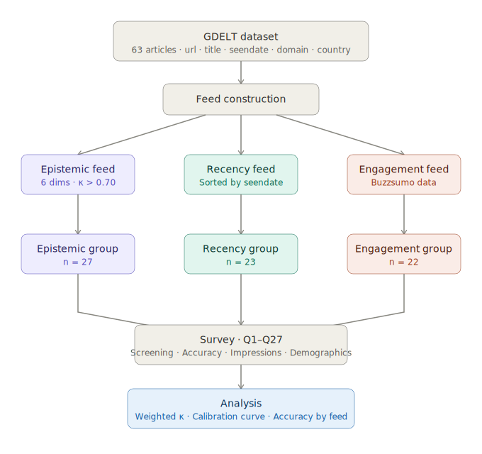

# Does Feed Curation Shape What Readers Know?

_A Controlled Experiment on Algorithmic News Exposure_

Zeynep Guzey, Jaeyun Stella Seo, Inseon Hwang, Jocelyn Ding

CS 294-273 Designing Algorithmic Media, Spring 2026

Professor Jonathan Stray

This Github repo contains all relevant files pertaining to the project, which explores how news feed curation can affect beliefs in the aftermath of a crisis. In particular, we build a case study around the assassination attempt of Slovakian Prime Minister Robert Fico in 2024. We find that though users of the feeds do not perceive them to be any different (eg: more trustworthy, more biased), users of the engagement-optimized feeds are confidently wrong about their answers to factual questions surrounding the event.

## Motivation

When a crisis unfolds, information is not yet fully verified and exists in a state of uncertainty. In such circumstances, journalists and the public discuss it with varying degrees of certainty, confirmability, and accuracy.

As media sources proliferate, the curation of content is becoming increasingly important. However, the extent of its impact has not been fully measured.

We hope to explore whether, without any alteration to the content itself, the algorithm can affect readers' understanding — and whether this aligns with readers' confidence — so that we can examine whether such influence operates implicitly or explicitly.

## Methodology

Using baseline feed algorithms that rely on broadly used features — recency and engagement — we designed our own content-based feed algorithm intended to increase the reliability of information delivery and reduce sensationalism, which is often cited as a key quality of good journalism.

We also sought to differentiate from mainstream engagement-based approaches by analyzing the content itself and using it as the primary feature for the feed algorithm.



## Results

## Liminations & Future Work

1. The two baseline algorithms do not fully reflect real-world algorithms.
   For the recency feed, we assumed that readers encounter the feed 24 hours after the first article of a crisis is published. However, the timing of exposure — whether earlier or later — can affect readers' understanding.
   For the engagement algorithm, we could only use total engagement metrics for each article, without access to personal engagement history or the rate of engagement growth. More closely reflecting industry-standard engagement-based algorithms would yield more meaningful results, as they would better align with real-world conditions.

2. We were solely interested in maximizing readers' understanding of the content and their metacognition. However, platforms generally pursue multiple objectives — such as surfacing content that readers find most interesting or that generates the most discussion. While we propose that the current popular selection of features for feed algorithms is not optimal for readers' understanding and metacognition, we cannot conclude what the best feature selection would be when considering both goals simultaneously. A promising next step would be to explore this trade-off further.

3. We surveyed readers to measure the extent of their understanding, which is difficult to replicate at scale on social network platforms. Future work could explore engagement features, or combinations thereof, that can serve as proxies for user understanding — so that this research can be made more scalable and applicable.

4. Due to limitations in time and budget, it was difficult to recruit research participants that represent the full population of potential news consumers, which reduces the generalizability of the findings. Future work could consider utilizing LLM-based persona simulation as a complementary approach.

## Project Structure

```
feed-curation-and-reader-comprehension/
├── html/                  # Survey interface files
├── apps-script/           # Data collection automation
├── Codebook.pdf          # Article scoring methodology
└── data-and-analysis/    # Datasets and analysis notebooks
```

### html

Contains the HTML files used to build the Netlify surveys sent to participants.

### apps-script

Script written to collect survey information from the Netlify app to Google Sheets.

### Codebook.pdf

The codebook used to score articles across six different axes: evidence & attribution, uncertainty signaling, context completeness, conflict framing, affective intensity, and call to action.

### data-and-analysis

Contains the data (`engagement.csv`, `epistemic.csv`, `recency.csv`) used for our most recent analysis for the final report, as well as the data used to generate our final presentation (a week prior to the final report) within "Final Presentation." The analysis is done within `analysis.ipynb`.
